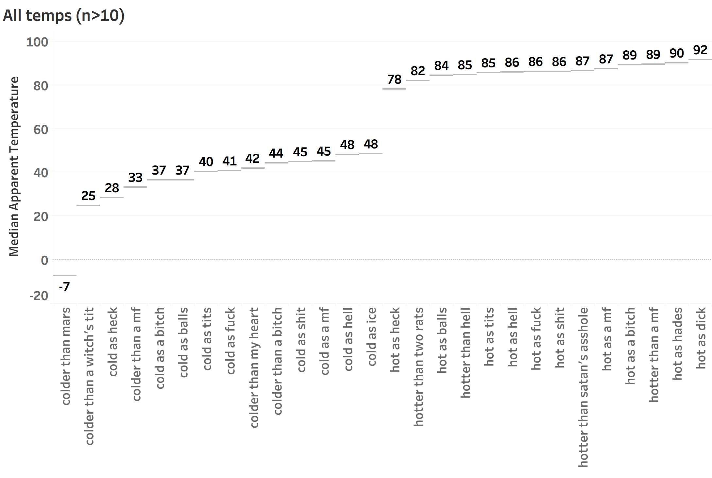
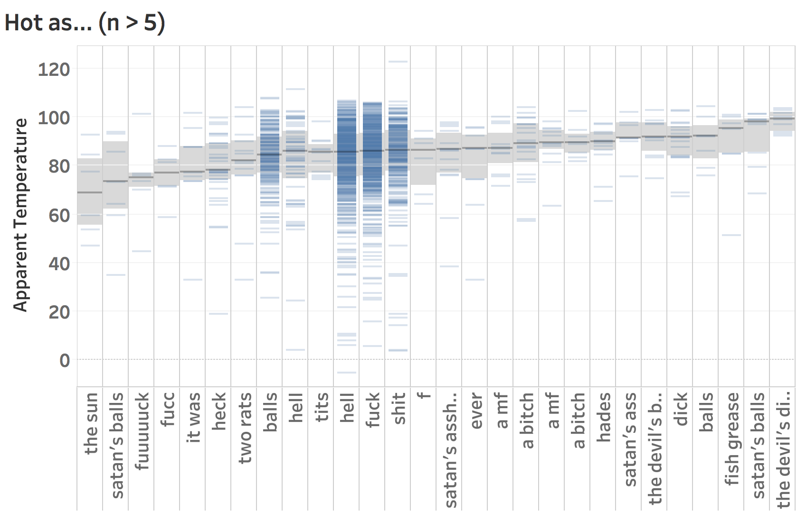
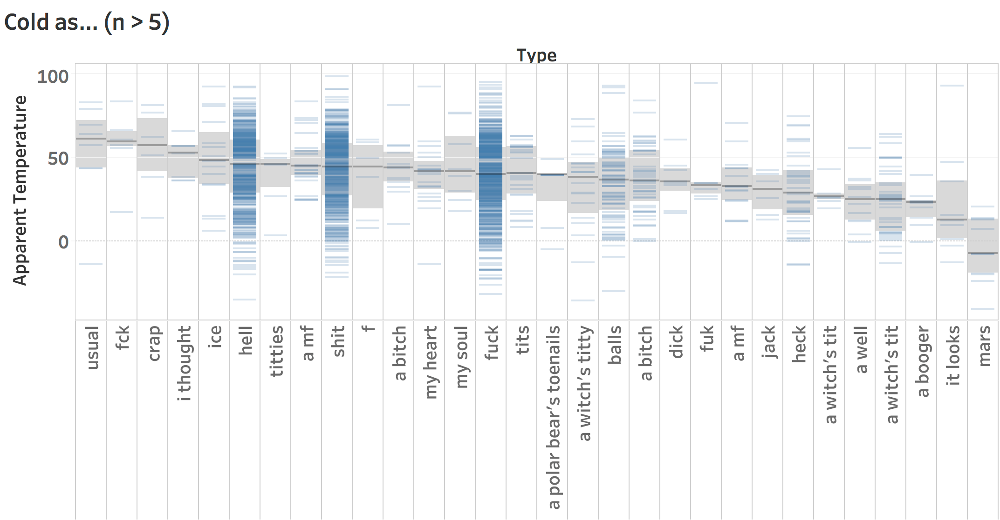
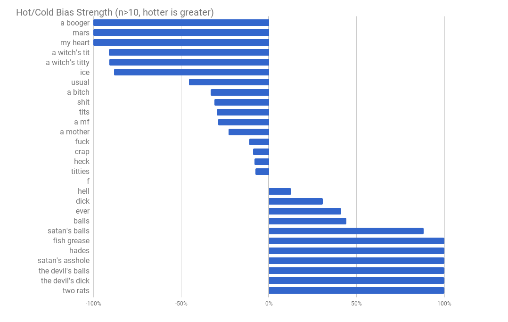

# A Curseword-Based Scale for Temperature

5,400 geolocated tweets with phrases like "it's hot as hell" or "it's cold as a bitch" were collected from August 2017 to January 2018, and the outdoor temperature collected for each.

The result is a derived curseword-based temperature scale: "it's hot as hell" is 86&deg;F, statistically speaking.

By [@jimwebb](https://twitter.com/jimwebb?lang=en), and presented at [Hack and Tell DC](http://dc.hackandtell.org/) (Presentation: [Keynote](presentation/cold-as-fuck.key) | [PDF](presentation/cold-as-fuck.pdf)). Thanks to [@metasemantic](https://github.com/thoppe/twitterf_cks) for inspiration and code.

### Observed median temperature, by phrase (n>10)


### Most popular phrases and median temperatures (&deg;F)

| Phrase                    | Count | Median Temp (&deg;F) |
|---------------------------|-------|---------------|
| (it's) cold as fuck              | 623   | 41&deg;F            |
| cold as shit              | 497   | 45&deg;F            |
| cold as hell              | 466   | 48&deg;F            |
| cold as balls             | 78    | 37&deg;F            |
| cold as a bitch           | 43    | 37&deg;F            |
|---------------------------|-------|---------------|
| hot as hell               | 549   | 86&deg;F            |
| hot as fuck               | 495   | 86&deg;F            |
| hot as shit               | 261   | 86&deg;F            |
| hot as balls              | 197   | 84&deg;F            |
| hotter than hell          | 58    | 85&deg;F            |

### Detail: hot subjects (n>5)
Displayed with frequency, median (black) and 95% confidence (gray)



### Detail: cold subjects (n>5)
Displayed with frequency, median (black) and 95% confidence (gray)



### "Hell" can be hot or cold

"Cold as hell" (48&deg;F) and "hot as hell" (86&deg;F) exist together, and hell isn't the only subject with this duality:

| Phrase          | When Hot (&deg;F) | When Cold (&deg;F) |
|---------------|-----|------|
| dick          | 92  | 36   |
| satan's balls | 90  | 34   |
| a witch's tit | 90  | 26   |
| a bitch       | 89  | 38   |
| a mf          | 88  | 42   |
| a mother      | 88  | 29   |
| ever          | 87  | 59   |
| f             | 87  | 45   |
| tits          | 85  | 40   |
| shit          | 85  | 45   |
| hell          | 85  | 47   |
| fuck          | 84  | 41   |
| balls         | 84  | 36   |
| heck          | 78  | 28   |

### "Boogers" are always cold; "The Devil's Dick" is always hot

Some subjects are strongly biased in one direction or another; that is, they're only used in the "hot" context (or "cold"). 

For instance, "boogers" and "Mars" are always cold and never hot; "the devil's dick" and "two rats (fucking)" are always hot; and other subjects lean one way or the other:




#### Data set 

Dataset provided in [`data/collected-tweets.csv`](data/collected-tweets.csv). [Contact me](https://twitter.com/jimwebb/) for raw tweets (250MB).

#### Data collection

    python src/0-scrape.py

Collects tweets into the folder `raw_firehose` (which you'll need to create). Requires a file in the local directory named `access_tokens.json` with your [Twitter API keys](https://developer.twitter.com/):

``` python
{
    "key":"XXXXXXXXXXXXXXXXXXXXXXXXX",
    "secret":"XXXXXXXXXXXXXXXXXXXXXXXXXXXXXXXXXXXXXXXXXXXXXXXXXX",
    "access":"XXXXXXXXXXXXXXXXXXXXXXXXXXXXXXXXXXXXXXXXXXXXXXXXXX",
    "access_secret":"XXXXXXXXXXXXXXXXXXXXXXXXXXXXXXXXXXXXXXXXXXXXX"
}
```

#### Processing

Set up SQLite database for processing (one-time)

    php src/1-dbsetup.php

Parse the tweets and organize by phrasing

    php src/2-collect-tweets.php

Poll the Dark Sky API for temperatures (edit file with your [Dark Sky API key](https://darksky.net/dev))

    php src/3-get-weather.php